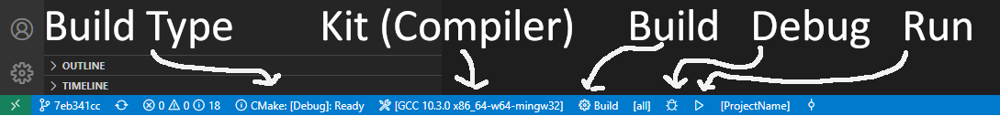

# CppTemplate
This repo is a simple template to help you start a C/C++ project using CMake. The setup instructions are currently only for Windows but can be adapter for other platforms. The usage instructions should work on any platforms, apart from the method of executing the binary which will be different on other platforms.

This system uses CMake and therefore the file type (.c or .cpp) dictates which compiler is used. If you want this to be a C project, ensure source files have the .c extension. For cpp the .cpp extension.

## Table of Content
- [CppTemplate](#cpptemplate)
  - [Table of Content](#table-of-content)
  - [Windows Setup (GCC)](#windows-setup-gcc)
    - [Compiler](#compiler)
    - [Build Tools](#build-tools)
  - [Usage](#usage)
    - [Building and running the Project](#building-and-running-the-project)
    - [Renaming the Project](#renaming-the-project)
  - [VSCode Setup](#vscode-setup)
  - [End Note](#end-note)

## Windows Setup (GCC)
### Compiler
This is a rewrite of [this guide on 
stackoverflow](https://stackoverflow.com/questions/30069830/how-to-install-mingw-w64-and-msys2).

- Download [MSYS2](https://www.msys2.org/) and install.     
- Run MSYS2.     
- Update package database and base package by running:
  - `packman -Syu`.     
- Relaunch MSYS2 and run to finish the process:
  - `packman -Su`    
- Install GCC by running (You may need to press enter when prompted what to install):
  - `pacman -S mingw-w64-x86_64-toolchain`
- or on 32 bit machines run:
  -  `pacman -S mingw-w64-i686-toolchain`.       
- Now start MSYS2 MinGW x64/x86 and check the install worked by running:
  -  `gcc --version`
- If this does provide output with a gcc version try repeating the above steps or create an issue in this repo. 

You now have your compiler install, to allow you access it anywhere without needing to provide its location add <MSYS2 root>/mingw64/bin or <MSYS2 root>/mingw32/bin to your PATH. This guide will assume that you have done this. 

### Build Tools
There are a couple of other programs required:
- [Git for Windows](https://gitforwindows.org/)   
- [CMake](https://cmake.org/download/) 
- (Optional) [Ninja](https://github.com/ninja-build/ninja/releases) 

Download and install them (If using Ninja I suggest creating a `ninja` folder in you C drive and moving the ninja.exe to it). During this process, CMake will ask if you want it added to PATH, click yes as it will it make it a lot easier to run commands (and this guide will assume you have).    

Note: You need to download these for your Host OS, don't try and install them through MSYS as it will not work.

## Usage
### Building and running the Project
- Clone the repo and enter the directory in your terminal    
- Create a build directory with:
    - `mkdir build`    
- Configure CMake with Make:
    - `cmake -S . -B build -G "MinGW Makefiles"`
- or to use Ninja:
    - `cmake -S . -B build -G Ninja`  
- Now to build the project:
  - `cmake --build build`    
- If everything has gone to plan you can now run the binary with:
  -  `.\build\Debug\ProjectName.exe`
- or (depends on what generator you used):
  -  `build\ProjectName.exe`
- And `Hello, World` should appear!    
 
You now have a basic C/C++ with CMake environment setup    

### Renaming the Project
The first step you may want to do is rename the project.

- Open the CMakeList.txt and change the line that reads `project(ProjectName)` to `project(YourProjectName)`     
- In your terminal, in the project directory, run `cmake --build build --target clean` or delete the contents of the build folder    
- This has removed the old stuff from the build folder and built your new project    
- Now test the program by running `.\build\YourProjectName.exe` and you should get `Hello, World` back!

## VSCode Setup
VSCode is a great text editor that can be used as development environment. Below is a quick start guide to VSCode and CMake. 

- [Download VSCode](https://code.visualstudio.com/) if you haven't.
- Once downloaded, go the extensions tab of the left and install the following extensions:
    - CMake Tools
    - C/C++
- Now open the directory of the project you setup earlier.
- If asked "Would you like to configure project 'CppTemplate'? Click `Yes` 
- You should now be able to see bar at bottom, shown below.   

    - The "Build Type" button lets you set your build for release or debug (or any other builds you want to support)
    - The "Kit" button lets you set your compiler, if you are following this guide on Windows you want to select the GCC...mingw32 option.
    - The "Build" button starts a build.
    - The "Debug" button starts a debugging session (It build first, then launch the debugger).
    - The "Run" button starts the programing normally (It build first, then launch).
    - These can all be bound to a key, see File->Preference->Keyboard Shortcuts.
- If you have already followed the setups in the "Building and running the Project" section, you can just click the "Run" button and your program should launch.
- If this fails with the error `No useable generator found` while building:
  - File->Preference->Settings.
  - Search `generator`.
  - Add `MinGW Makefiles` to the `Cmake: Generator` field.
  - Now try clicking the build button. 
  - If you have Ninja installed you can write `Ninja` instead of `MinGW Makefiles`.
- Make sure your build is set to Debug while debugging or the debugger will not work.

## End Note
I plan to expand this project as I develop a better understanding on CMake. Feel free to create issues if you are having problem and I'll do my best to help, please be as descriptive as possible. Pull request are also welcome to improve the current template or add more.